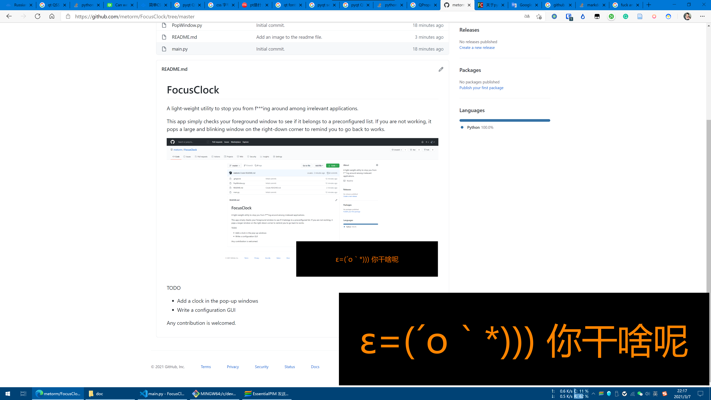

# FocusClock

A light-weight utility to stop you from f***ing around among irrelevant applications.

This app simply checks your foreground window to see if it belongs to a preconfigured list. If you are not working, it pops a large and blinking window on the right-down corner to remind you to go back to works.

TODO

+ Add a clock in the pop-up windows
+ Write a configuration GUI

Any contribution is welcomed.
